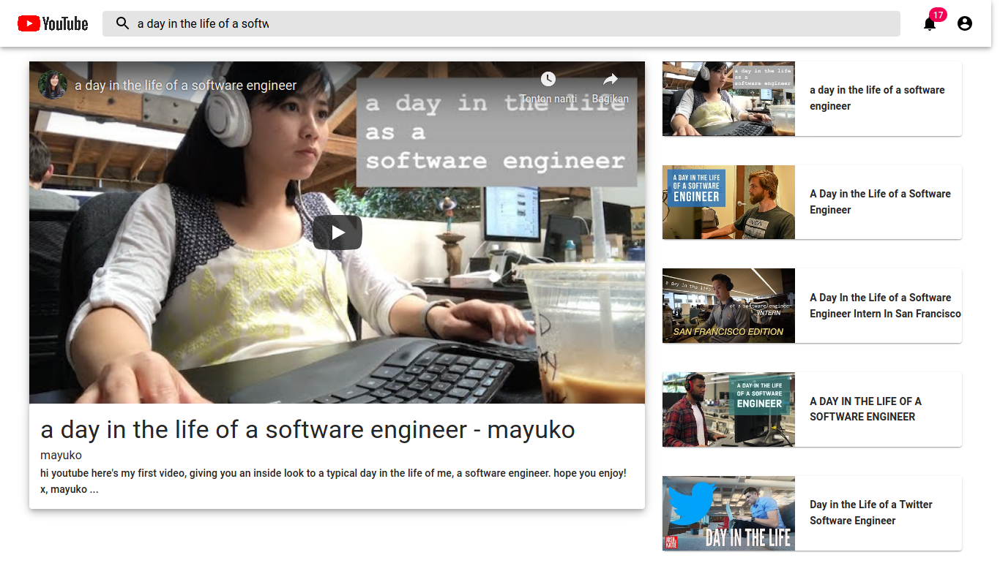

# DCC-1---Youtube-Clone-App
I started this challenge, so I can be better with my code, get new skills, and trying not to forgot what have I learned. This is my first challenge. I'm trying to build a web app application that can search the video using YOUTUBE API, using React as the frontend framework, Material Ui as the CSS framework.

## Available Scripts

In the project directory, you can run:

### `yarn start or npm start`

Runs the app in the development mode. 
Open [http://localhost:3000](http://localhost:3000) to view it in the browser.

### App Preview

